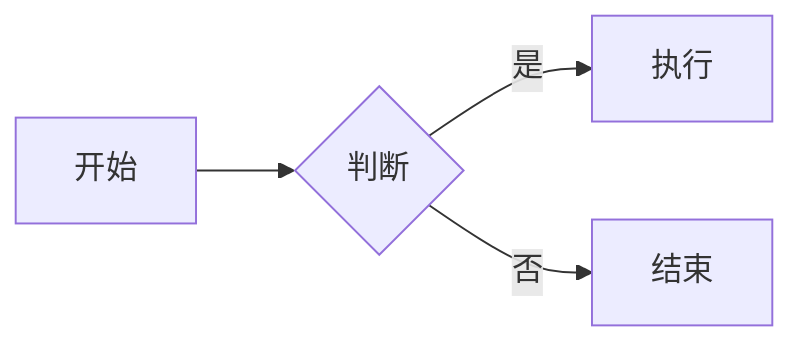
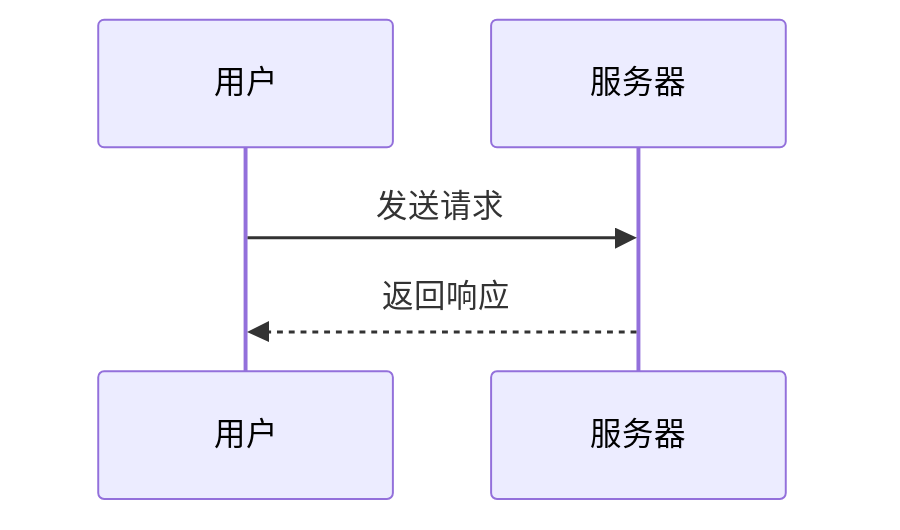

# Markdown 语法大全

> 每个语法：先一行「源码写法」，紧跟一行「渲染效果」。
> 在支持 Markdown 的编辑器（如 Typora、VS Code 预览、GitHub）中打开本文件即可看到效果对照。

---

## 一、标题 Headings

`# 一级标题`

# 一级标题

`## 二级标题`

## 二级标题

`### 三级标题`

### 三级标题

`#### 四级标题`

#### 四级标题

`##### 五级标题`

##### 五级标题

`###### 六级标题`

###### 六级标题

一级标题（下划线式）：`标题文字` 下一行 `===`

一级标题（下划线式）
===

二级标题（下划线式）：`标题文字` 下一行 `---`

二级标题（下划线式）
---

---

## 二、文本样式 Text Styles

`**加粗文本**`
**加粗文本**

`*斜体文本*`
*斜体文本*

`***加粗又斜体***`
***加粗又斜体***

`~~删除线文本~~`
~~删除线文本~~

`` `行内代码` ``
`行内代码`

`==高亮文本==`（部分编辑器支持，如 Typora）
==高亮文本==

`H~2~O`（下标，部分编辑器支持）
H~2~O

`X^2^`（上标，部分编辑器支持）
X^2^

`普通文本 <u>下划线</u>`（借助 HTML）
普通文本 <u>下划线</u>

`文本 <br> 强制换行`（借助 HTML 换行）
文本 <br> 强制换行

---

## 三、段落与换行 Paragraphs & Line Breaks

段落之间用一个空行分隔：

这是第一段。

这是第二段。

行末加两个空格再回车 = 软换行（本行末尾有两个空格）  
换行后的内容。

---

## 四、列表 Lists

无序列表 `- 项目`：

- 项目一
- 项目二
- 项目三

无序列表 `* 项目`（等价写法）：

* 苹果
* 香蕉

无序列表 `+ 项目`（等价写法）：

+ 猫
+ 狗

有序列表 `1. 项目`：

1. 第一步
2. 第二步
3. 第三步

嵌套列表（子项缩进 2~4 个空格）：

- 一级项目
  - 二级项目
    - 三级项目
- 一级项目

任务列表 `- [ ]` / `- [x]`：

- [x] 已完成任务
- [ ] 未完成任务

---

## 五、引用 Blockquotes

`> 这是引用`

> 这是引用

多级引用 `>>`：

> 一级引用
>
> > 二级引用
> >
> > > 三级引用

引用中包含其他元素：

> **加粗**、*斜体* 和 `代码`
>
> - 列表项也能放进引用

---

## 六、代码 Code

行内代码：`` `const a = 1` ``
`const a = 1`

代码块（用三个反引号包裹，可标注语言）：

```python
def hello():
    print("Hello, Markdown!")
```

```javascript
function hello() {
  console.log("Hello, Markdown!");
}
```

无语言标注的代码块：

```
纯文本代码块
不做语法高亮
```

缩进式代码块（每行前 4 个空格）：

    这是缩进式代码块
    commonly used for plain text

---

## 七、链接 Links

行内链接 `[文字](URL)`：
[百度](https://www.baidu.com)

带标题的链接 `[文字](URL "悬停提示")`：
[百度](https://www.baidu.com "点击访问百度")

自动链接 `<URL>`：
<https://www.baidu.com>

引用式链接 `[文字][标记]`：
[搜索引擎][google]

[google]: https://www.google.com

页内锚点跳转 `[文字](#标题)`：
[跳到顶部标题](#一标题-headings)

---

## 八、图片 Images

行内图片 ``：


带标题的图片 ``：


带链接的图片（点击图片跳转）`[](链接URL)`：
[](https://www.baidu.com)

控制图片大小（借助 HTML）：


---

## 九、表格 Tables

基本表格（`|` 分列，`---` 分隔表头）：

| 姓名 | 年龄 | 城市 |
| ---- | ---- | ---- |
| 张三 | 25   | 北京 |
| 李四 | 30   | 上海 |

对齐方式（`:` 控制左/中/右对齐）：

| 左对齐 | 居中对齐 | 右对齐 |
| :----- | :------: | -----: |
| left   |  center  |  right |
| 文字   |   文字   |   文字 |

---

## 十、分隔线 Horizontal Rule

`---`
---

`***`

***

`___`

___

---

## 十一、转义字符 Escaping

用反斜杠 `\` 转义特殊字符：

`\*不显示为斜体\*`
\*不显示为斜体\*

`\# 不显示为标题`
\# 不显示为标题

`1\. 不显示为列表`
1\. 不显示为列表

常见可转义字符：`\` `` ` `` `*` `_` `{}` `[]` `()` `#` `+` `-` `.` `!` `|`

---

## 十二、脚注 Footnotes

`这里有一个脚注[^1]`（部分编辑器支持）
这里有一个脚注[^1]

[^1]: 这是脚注的内容说明。

---

## 十三、定义列表 Definition Lists

（部分编辑器支持，如 Typora）

术语
: 定义内容一
: 定义内容二

---

## 十四、Emoji 表情

`:smile:` `:heart:` `:+1:`（GitHub 等平台支持简码）
:smile: :heart: :+1:

也可直接粘贴 Unicode 表情：😀 ❤️ 👍

---

## 十五、HTML 混排

Markdown 中可直接嵌入 HTML 标签：

`<kbd>Ctrl</kbd> + <kbd>C</kbd>`
<kbd>Ctrl</kbd> + <kbd>C</kbd>

`<mark>标记高亮</mark>`
<mark>标记高亮</mark>

折叠内容 `<details>`：

<details>
<summary>点击展开</summary>


这里是被折叠的内容，可以包含 **Markdown** 语法。

</details>

居中（借助 HTML）：

<center>居中文本</center>

---

## 十六、数学公式 Math (LaTeX)

（需编辑器支持 KaTeX/MathJax，如 Typora、Obsidian、GitHub）

行内公式 `$E = mc^2$`：
$E = mc^2$

块级公式 `$$...$$`：
$$
\int_{a}^{b} f(x)\,dx = F(b) - F(a)
$$

---

## 十七、图表 Mermaid

（GitHub、Typora、Obsidian 等支持，用 ` ```mermaid ` 代码块）

流程图：



时序图：



---

## 附：常用语法速查表

| 需求     | 写法                 |
| -------- | -------------------- |
| 加粗     | `**文字**`           |
| 斜体     | `*文字*`             |
| 删除线   | `~~文字~~`           |
| 行内代码 | `` `文字` ``         |
| 链接     | `[文字](URL)`        |
| 图片     | ``        |
| 无序列表 | `- 项目`             |
| 有序列表 | `1. 项目`            |
| 引用     | `> 文字`             |
| 标题     | `# 文字`（1~6 个 #） |
| 分隔线   | `---`                |
| 表格     | `\| 列1 \| 列2 \|`   |
| 任务列表 | `- [ ]` / `- [x]`    |

---

> 说明：`==高亮==`、`~下标~`、`^上标^`、脚注、定义列表、数学公式、Mermaid 等属于**扩展语法**，
> 并非所有编辑器都支持；标准语法（标题、列表、链接、图片、表格等）则通用。
